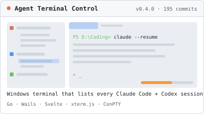
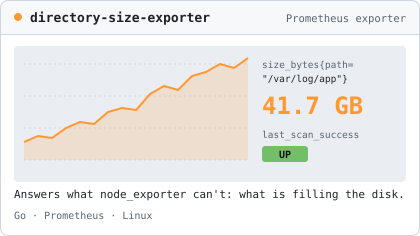
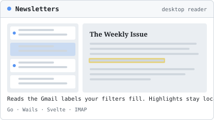
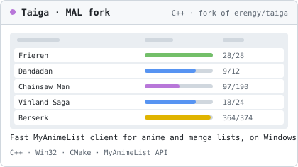
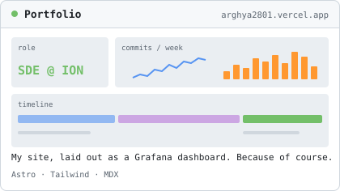
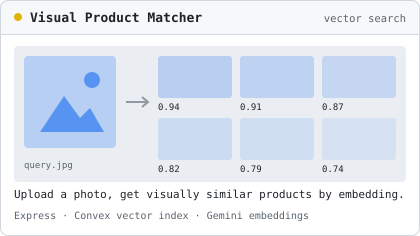

### Hey, I'm Arghya

I work on observability at **ION Trading**: Java and Spring services that collect metrics and logs across the platform, plus the Prometheus, Grafana and OpenSearch setup engineers use during an incident.

Outside work I mostly build desktop tools for Windows that fix my own annoyances. They're usually Go with a Svelte UI, and they go all the way to a proper installer and a release page.

---

### What I've been building

<table>
<tr>
<td width="50%"></td>
<td width="50%"></td>
</tr>
<tr>
<td></td>
<td></td>
</tr>
<tr>
<td></td>
<td></td>
</tr>
</table>

- **[Agent Terminal Control](https://github.com/arghya2801/agent-terminal-control):** I got tired of `claude --resume` and trying to remember which folder a session lived in. ATC reads `~/.claude/projects` and Codex's history and puts every session under its project, one click to resume. It runs a real ConPTY terminal with tabs, split panes, tasks linked to branches, and a usage page that shows what the tokens would have cost at API prices. Started on Tauri/Rust, now on Go/Wails.
- **[directory-size-exporter](https://github.com/arghya2801/directory-size-exporter):** node_exporter tells you a volume is 90% full. This tells you which directory filled it. Scans run in the background with timeouts and concurrency caps, and a failed scan never publishes partial numbers, so it can't fake a capacity drop and set off alerts.
- **[Newsletters](https://github.com/arghya2801/email_newsletter_reader):** a reader for the Gmail labels my filters already sort newsletters into. It's not a mail client. The only change it makes to the mailbox is marking an issue read.
- **[Taiga fork](https://github.com/arghya2801/taiga):** my fork of erengy's Taiga rewrite, turned into a fast MyAnimeList client with manga support, sortable columns, cached posters and a flat theme.

Older stuff

- [code_review_ai_agent](https://github.com/arghya2801/code_review_ai_agent_backend) ([frontend](https://github.com/arghya2801/code_review_ai_agent_frontend)): an AI code reviewer attached to a LeetCode-style coding platform
- [Intelligent Order Parameter Prefill](https://github.com/arghya2801/Intelligent-Order-Parameter-Prefill-Frontend): hackathon project
- [e-commerce-spring-backend](https://github.com/arghya2801/e-commerce-spring-backend) and [e-commerce](https://github.com/arghya2801/e-commerce): the same store built twice, once in Spring Boot and once in Express + MongoDB
- [accountability-tracker](https://github.com/arghya2801/accountability-tracker): public goals, so your friends can call you out
- [convert2pdf](https://github.com/arghya2801/convert2pdf): PowerShell CLI to batch-convert Word, Excel and PowerPoint files to PDF
- [aws_disaster_recovery](https://github.com/arghya2801/aws_disaster_recovery): kill EC2 in one region, bring it back in another, with Lambda handling the AMIs

---

### Stack

 

Also: OpenSearch · Fluent Bit · Convex · Wails. AWS Solutions Architect Associate, OCI DevOps Professional.
